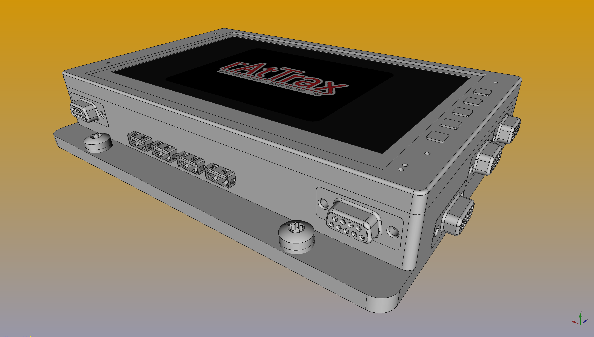

# rAtTrax-7inLCD-BBBWC

rAtTrax 7inLCD-BBBWC is based on the Beaglebone Black wireless & BBB-EXP7H CAPE

Beaglebone Black Wireless -info 
Purchase; 
https://www.digikey.com/product-detail/en/ghi-electronics-llc/BBBWL-SC-562/BBBWL-SC-562-ND/6211000 

Datasheet 
https://media.digikey.com/pdf/Data%20Sheets/Circuitco%20Elect/BBBWL-SC-562.pdf 

With SVTronics Inc. 7in LCD CAPE aka Chipsee BBB-EXP7H - info 
Purchase; 
https://www.digikey.com/product-detail/en/BBEXPDTC70/1055-1007-ND/4823859/?itemSeq=280515161 
Datasheet; 
https://svtronics.com/index.php?route=product/download&product_document_id=323&product_id=52

 

rAtTrax Aluminum Housing for BBB-EXP7H
 
DC power supply 
 
Generic USB 2.0 - 4-port - HUB

